  # **Takım & Ürün İsmi**
### **`muse`**
# Takım ve Ürün Hakkında Bilgilendirme
## Takım Üyeleri 
 

  <table>
    <tr>
      <th>İsim</th>
      <th>Görev</th>
      <th>İletişim</th>
    </tr>
    <tr>
      <td>Erdal Tanırkut</td>
      <td>Scrum Master</td>
      <td>
        
        
      </td>
    </tr>
    <tr>
      <td>Elif Öztürk</td>
      <td>Product Owner</td>
      <td>
        
      </td>
    </tr>
    <tr>
      <td>Engincan Çiçek</td>
      <td>Developer</td>
      <td>
        
        
      </td>
    </tr>
    <tr>
      <td>Elif Güven</td>
      <td>Developer</td>
      <td>
        
        
      </td>
    </tr>
    <tr>
      <td>Enes Kaan Afacan</td>
      <td>Developer</td>
      <td>
        
        
      </td>
    </tr>
  </tr>
  </table>

## Ürün Tanıtımı
Muse her yaştan sanatseverlerin ve sanatçıların her türlü sanat eserini sergileyebileceği,  hoşuna giden eserleri açık arttırma yoluyla ya da direkt ödeme ile satın alabileceği bir platformdur. Muse olarak amacımız günümüz dünyasında hızına yetişilemeyen dijitalleşme trendini yakalayamamış alanlardan biri olan dijital dönem öncesi sanat eserlerini yediden yetmişe tüm dünya için erişilebilir kılmak bunun yanında genç ya da acemi sanatçıların eserlerini her yaştan sanatseverlere ulaştırabilmek. 

    
<h2>Ürün Özellikleri</h2>

  <h3>Sanat Eseri Paylaşım Platformu:</h3>
    
muse ile eserlerinizi dünyanın dört bir yanındaki sanat tutkunlarına ulaştırabilirsiniz, ilgilendiğiniz eserleri beğenip profilinize kaydedebilirsiniz.

  <h2>Sanat Eseri Satışı:</h2>
    
muse kullanıcılarına destek vermek istedikleri sanatçılara mesafe fark etmeksizin destek verme imkanı sunar. Siz evinizi eşsiz eserlerle süslerken favori sanatçılarınıza destekte bulunmuş olursunuz.

  <h2>Gerçek Zamanlı Açık Arttırma Etkinlikleri:</h2>
    
Tek tık ile açık arttırma ! muse kültür sanat dünyasının önemli değerlerinden olan açık arttırma geleneğini teknolojinin imkanlarıyla harmanlar.Evinizin konforunda açık arttırma heyecanını doyasıya yaşayabilirsiniz. 

  <h2>Hızlı ve Güvenli Ödeme Sistemi:</h2>
    
muse aracılığıyla yaptığınız satın almalar hızlı ve güvenli bir şekilde sonuçlanır.

  <h2>Ödüllendirme ve Rozet sistemi:</h2>
    
Muse ile yaptığınız paylaşımlar ya da satın alımlar sonucu. Sanatseverliğinizi gösterebileceğiniz ödüller ve rozetlerle profilinizi süsleyebilirsiniz.

  

  

    
<h2>Hedef Kitlemiz</h2>

    
•  Bağımsız Sanatçılar: Eserlerini sergileyerek geniş bir izleyici kitlesine ulaşmak isteyen bağımsız sanatçılar.
•  Yeni Başlayanlar: Sanat kariyerine yeni adım atan ve eserlerini tanıtarak isimlerini duyurmak isteyen sanatçılar.
•  Profesyonel Sanatçılar: Kariyerlerinde ilerlemiş ve eserlerini daha fazla kişiye ulaştırmak isteyen sanatçılar.
•  Sanat Koleksiyoncuları: Yeni ve benzersiz sanat eserlerini keşfetmek ve koleksiyonlarını genişletmek isteyen koleksiyoncular.
•  Sanat Meraklıları: Farklı sanat dallarından ve tarzlardan eserleri incelemek isteyen bireyler.
•  Öğrenciler ve Akademisyenler: Sanat eğitimi alan öğrenciler ve sanat tarihçileri için geniş bir sanat arşivi sunar.
•  Sanat Galerileri: Dijital platformda sergilerini duyurarak daha geniş bir izleyici kitlesine ulaşmak isteyen galeriler.
•  Sanat Kurumları: Müzeler, sanat okulları ve kültürel kuruluşlar, etkinliklerini tanıtmak ve sanatçılarla işbirliği yapmak için uygulamamızı kullanabilirler.
•  Genç ve Teknolojiye Yatkın Bireyler: Mobil cihazlarından sanat eserlerini keşfetmek ve sanata olan ilgilerini artırmak isteyen gençler.
•  Genel Kullanıcılar: Sanata ilgi duyan ve sanat dünyasında keyifli bir yolculuğa çıkmak isteyen herkes.

  

 

    
<h3>Sprint 1 - Uygulama Ekran Görüntüleri</h3>

  <table style="width: 100%;">
    <tr>
      <td colspan="4" style="text-align: center;"><h2>Giriş sayfaları</h2></td>
    </tr>
    <tr>
      <td style="width: 25%;">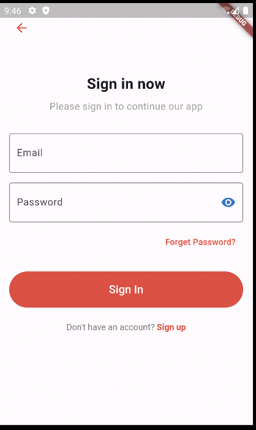</td>
      <td style="width: 25%;">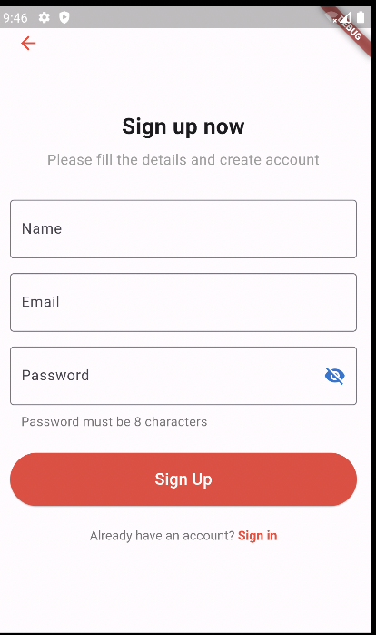</td>
    </tr>
    <tr>
      <td colspan="4" style="text-align: center;"><h2>Sanat eserleri sayfası</h2></td>
    </tr>
    <tr>
      <td style="width: 25%;">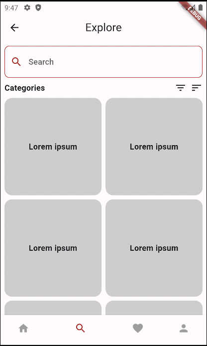</td>
    </tr>
    <tr>
      <td colspan="4" style="text-align: center;"><h2>Eser detay sayfası</h2></td>
    </tr>
    <tr>
      <td style="width: 25%;"></td>
    </tr>
  </table>
  
   

  

    
<h3>Sprint 1 - Sprint Board ekran görüntüleri</h3>

    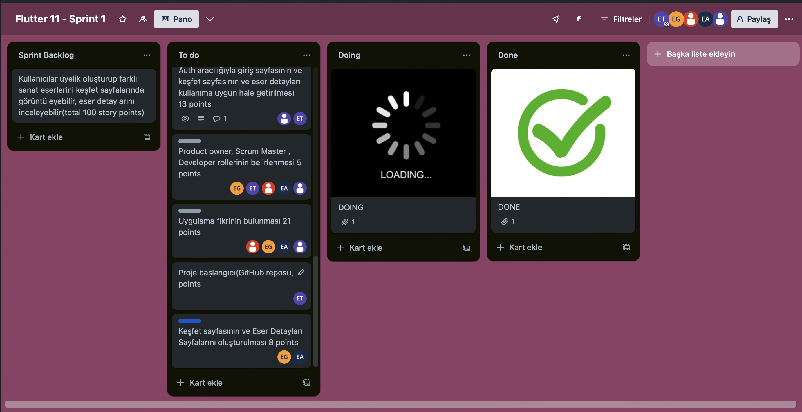
    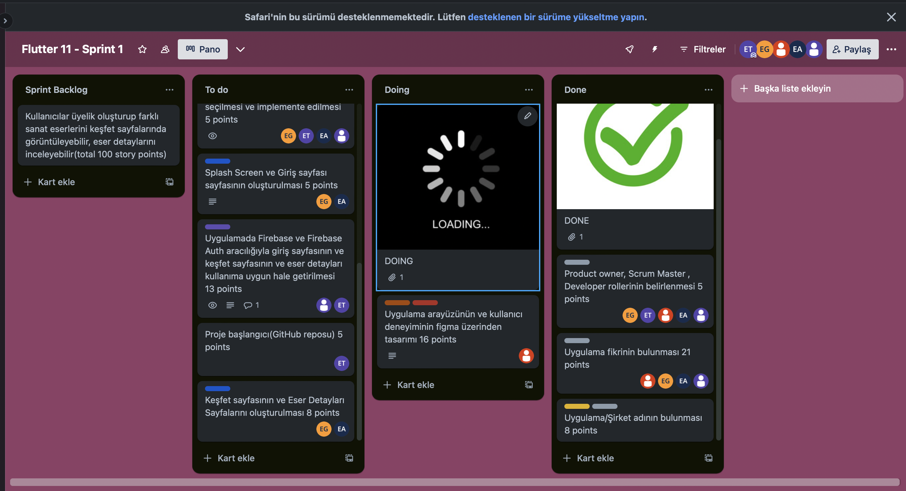
    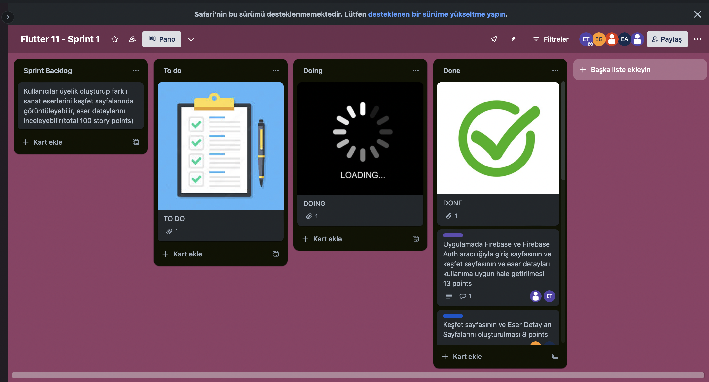
  

  

    
<h3>Sprint 1 - Burndown Chart</h3>

    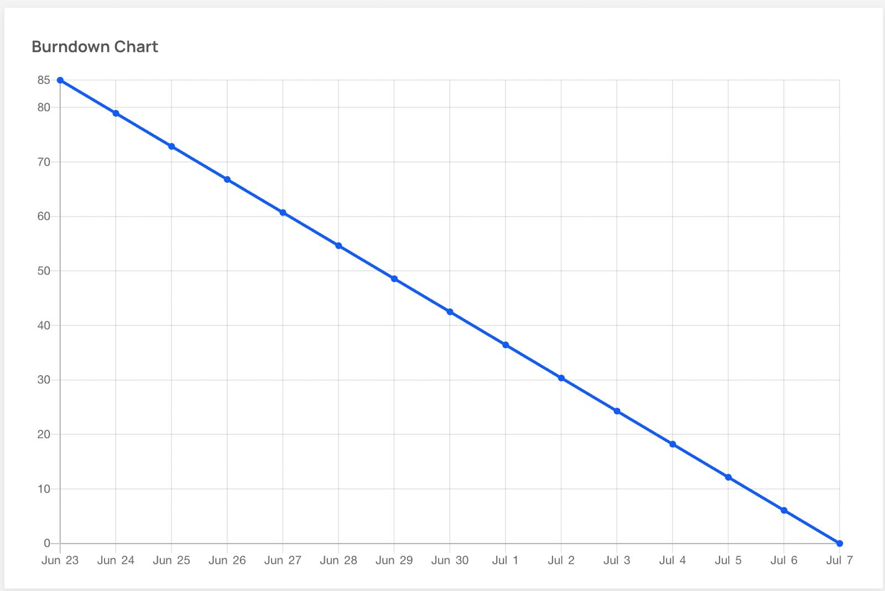
  

  

    
<h3>Sprint 1 - Günlük Scrumlar</h3>

    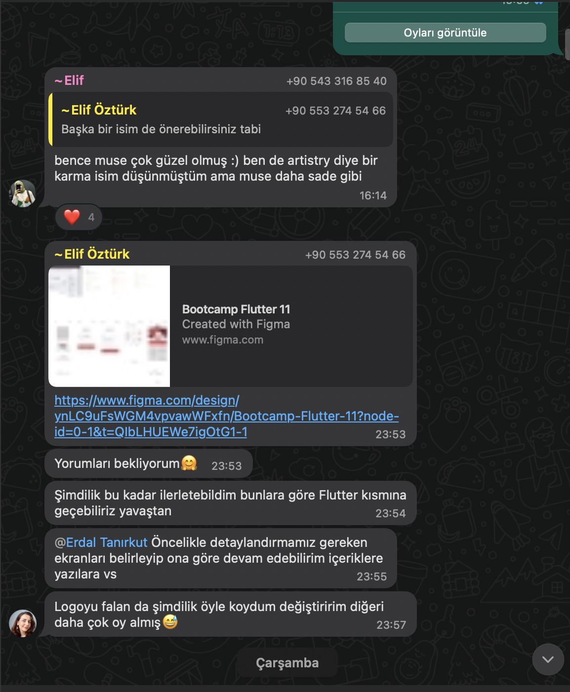
    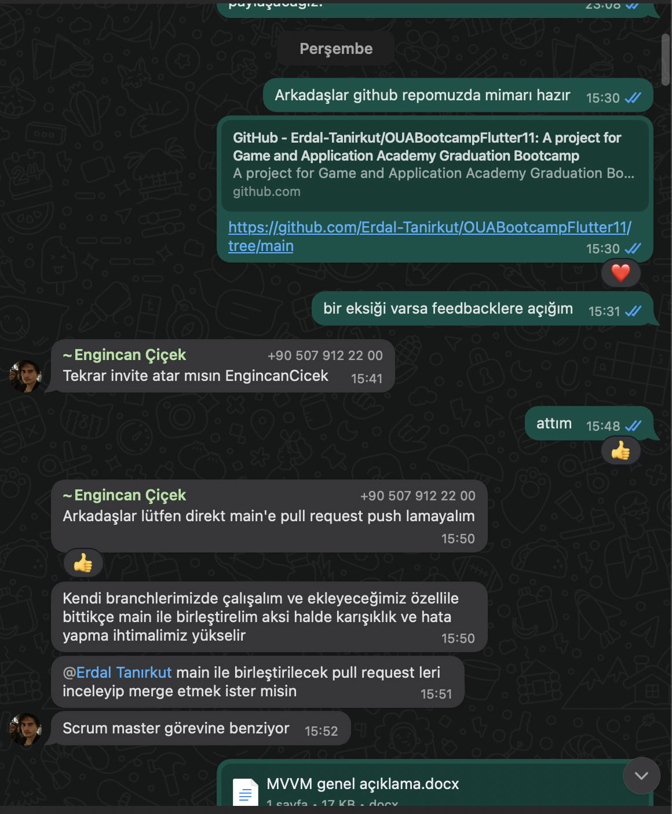
    
  

  - **Sprint Notları**:
    - Proje takibi için `Trello` kullanılmasına karar verilmiştir. 

    - Kullanıcı arayüzü tasarımı(UI) için `Figma` kullanılmasına karar verilmiştir.

    - State Management için `Provider` kullanılmasına karar verilmiştir.

    - Proje mimarisi `MVVM` olarak kararlaştırılmıştır.

    - Backend hizmetleri için `Firebase` kullanılmasına karar verilmiştir.

    - Sisteme giriş yöntemi olarak `email ile giriş` ve `Google hesabı ile giriş` yöntemlerinin kullanılmasına karar verilmiştir.
  - **Sprint için Hikaye Puanı Hedefimiz/Tahminimiz**: 100 puan
  - **Puan Tamamlama Mantığı**: Sprint başına düşen hikaye puanlarının tahmini dağılımı şu şekilde gösterilebilir: ilk sprint(100 puan),ikinci sprint(170 puan), üçüncü sprint (200 puan) . İlk iki sprintteki hedefin üçüncü sprinte göre daha düşük olmasının nedeni bu sprintlerde ekip arkadaşlarımızın final ve bütünleme takvimlerine denk gelmesinden dolayıdır. İlk sprint Backlog’unda bulunan tüm görevler tamamlanmıştır(100 puana ulaşılmıştır.)
- **Sprint Değerlendirmesi:**
    - Bu sprint için Engincan Backend kısmında sorumluluk alırken Erdal, Enes Kaan ve Elif Güven frontend geliştirme için sorumluluk aldı . Kullanıcı deneyimi ve arayüzü tasarımı Elif Öztürk tarafından yapılmıştır.

    - Bu sprrintte en çok zorlandığımız kısımlardan biri takım üyelerinin final sınavları sürecinde yeteri kadar iyi organize olup toplanılamamasıdırı.

    - Ek olarak çalışma zamanımızın normal sprintlerden daha az olduğu bu sprintin görevlendirmelerinin arasına uygulamanın bütün backend görevlerinin konulmasından dolayı backendle ilgili görevlerin yetiştirilmesinde takım olarak zorlandığımız bir başlık oldu. 

    - Sprinte başlamadan önce state management ve backend servisleriyle ilgili bir araştırma ve bilgi pekiştirme süreci geçirildi. Bu süreç sonunda provider ve firebase hakkında derinlemesine bilgi edinildi

    - Özetlemek gerekirse kısıtlı zaman dahilinde tüm takım olarak elimizden gelenin en iyisini yaptığımız söylenebilir.
- **Sprint Retrospectifi:**
    - Gelecek sprintler için backend görevlerini daha küçük parçaya bölme kararı alındı.

    -Yazılım konusundaki görev dağılımı verimli bulunup backend iş yükünün aşırı artması durumunda frontend developerların backend işlerine yardımcı olacağı konusunda fikir birliğine varıldı .

    - Sonraki sprintte toplantı günlerinin belirli günlere sabitlenmesi kararı alındı.

    - State management ve Backend için kullanılan servislerin amacımıza uygun ve verimli olduğu sonucuna varılıp bu teknolojilerle yola devam etme kararı alındı.

    - Sonraki sprint için profil sayfası, backend ve frontend arasındaki ara fonksiyonları, açık arttırma ekranı gibi özelliklere odaklanılmasına karar verildi.
  

    
<h3>Sprint 2 - Uygulama Ekran Görüntüleri</h3>

  <table style="width: 100%;">
    <tr>
      <td colspan="4" style="text-align: center;"><h2>Giriş sayfaları</h2></td>
    </tr>
    <tr>
      <td style="width: 25%;"></td>
      <td style="width: 25%;"></td>
    </tr>
    <tr>
      <td colspan="4" style="text-align: center;"><h2>Sanat eserleri sayfası</h2></td>
    </tr>
    <tr>
      <td style="width: 25%;"></td>
    </tr>
    <tr>
      <td colspan="4" style="text-align: center;"><h2>Eser detay sayfası</h2></td>
    </tr>
    <tr>
      <td style="width: 25%;"></td>
    </tr>
     <tr>
      <td colspan="4" style="text-align: center;"><h2>Profilim Sayfası</h2></td>
    </tr>
    <tr>
      <td style="width: 25%;"></td>
    </tr>
  <tr>
      <td colspan="4" style="text-align: center;"><h2>Sanat Eserlerim-Paylaşımlarım Sayfası</h2></td>
    </tr>
    <tr>
      <td style="width: 25%;">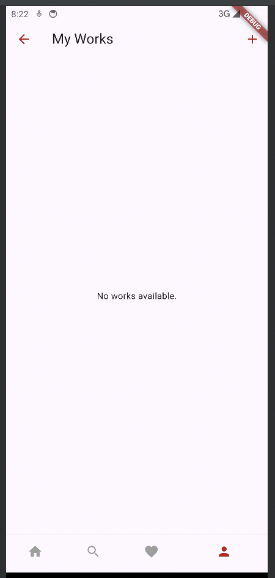</td>
    </tr>
  <tr>
      <td colspan="4" style="text-align: center;"><h2>Sanat Eserlerim-Paylaşımlarım Sayfası</h2></td>
    </tr>
    <tr>
      <td style="width: 25%;"></td>
      <td style="width: 25%;">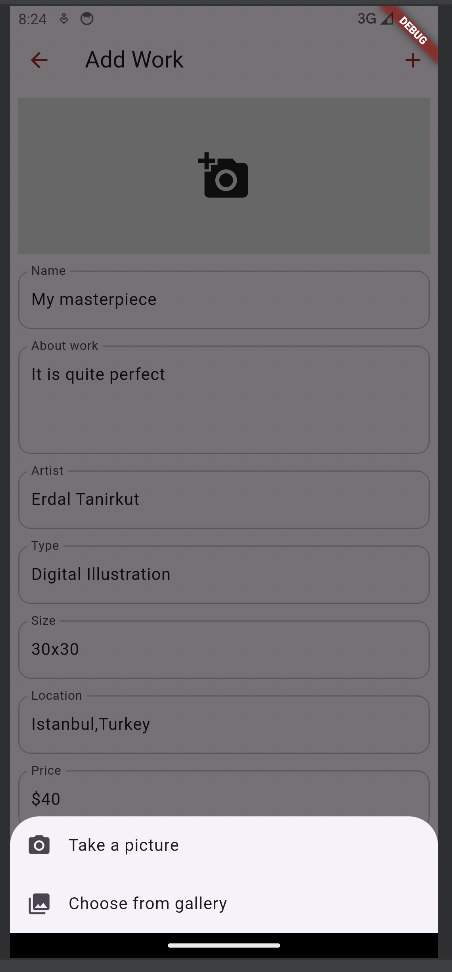</td>
      <td style="width: 25%;">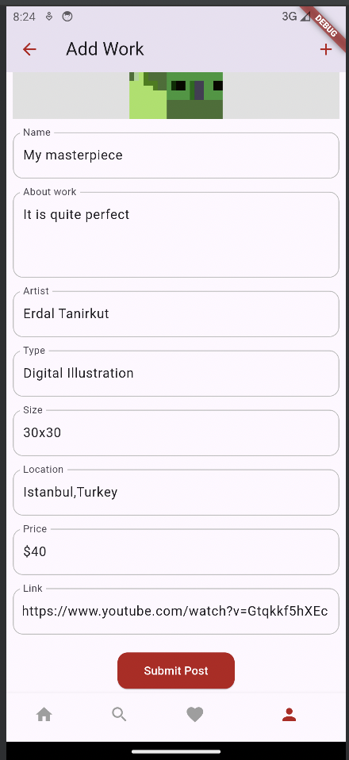</td>
    </tr>
  </table>
  
   

  

    
<h3>Sprint 2 - Sprint Board ekran görüntüleri</h3>

    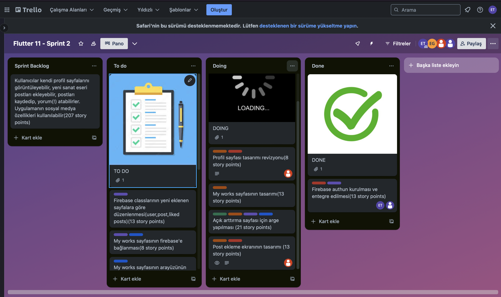
    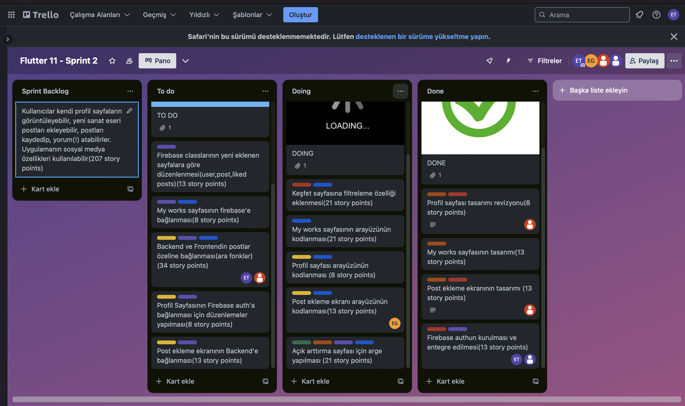
    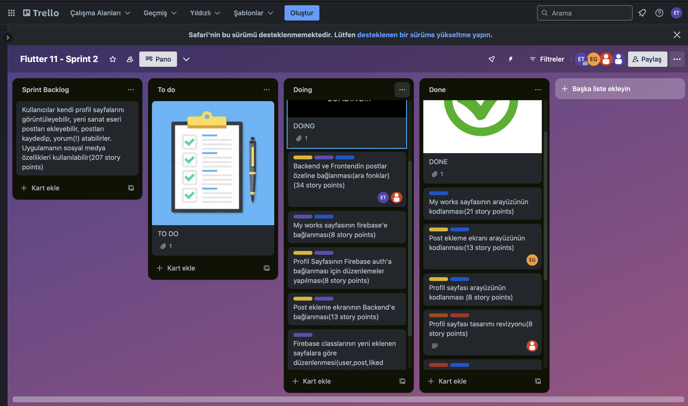
  
  

  

    
<h3>Sprint 2 - Burndown Chart</h3>

    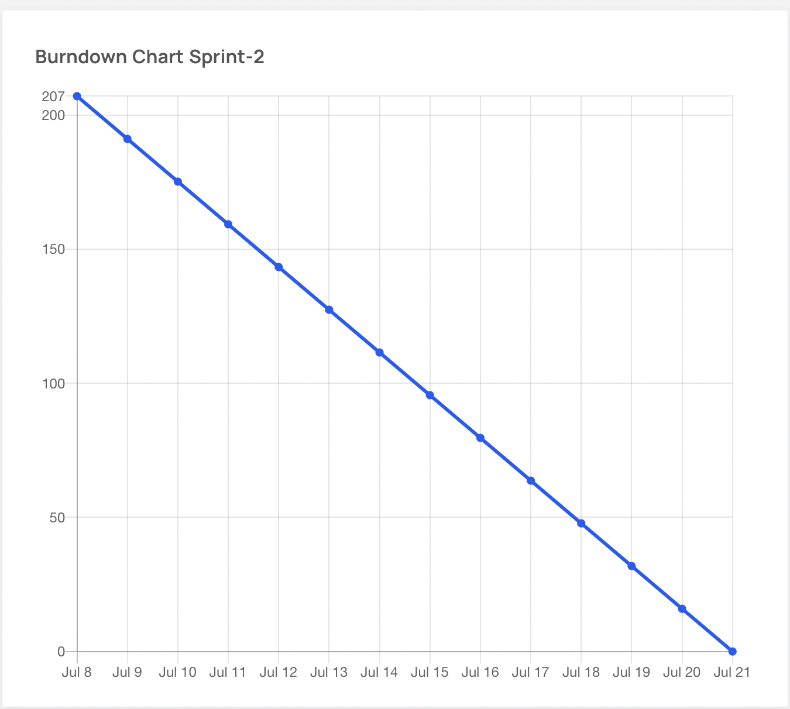
  

  

    
<h3>Sprint 2 - Günlük Scrumlar</h3>

    
    
    
  
  

    - **Sprint Notları**:
        - Görev yoğunluğu ve zaman kısıtları göz önüne alınarak `Açık arttırma özelliğinin` bu sprintte yapılacak arge sonucu eklenip eklenmeyeceğine karar verileceği belirlenmiştir.

        - Bu sprintte post ekleme, post beğenme gibi `Sosyal medya özelliklerine` odaklanılmasına karar verilmiştir.

        - Açık arttırma sayfası ArGesi sonucu yapılan oylamada özelliğin uygulamaya eklenmesi konusunda `Karar Verilememiştir` 3. Sprintin ilk toplantısında tekrardan bir oylama yapılacaktır.

        - Post ekleme ekranında fotoğraf seçmek için `flutter image_picker` kullanılması kararlaştırılmıştır.

        
- **Sprint için Hikaye Puanı Hedefimiz/Tahminimiz**: 170 puan
- **Puan Tamamlama Mantığı**: Sprint başına düşen hikaye puanlarının tahmini dağılımı şu şekilde gösterilebilir: ilk sprint(100 puan),ikinci sprint(170 puan), üçüncü sprint (200 puan) . Sprint 2 Backlog’unda bulunan tüm görevler ve ek işler tamamlanmıştır(207 puana ulaşılmıştır.)
- **Sprint Değerlendirmesi:**
    - Bu sprint için Engincan Backend kısmında sorumluluk alırken Erdal, Enes Kaan ve Elif Güven frontend geliştirme için sorumluluk aldı .Kullanıcı deneyimi ve arayüzü tasarımı Elif Öztürk tarafından yapılmıştır.

    - Bu sprrintte en çok zorlandığımız kısım backend ile frontend arasındaki bağlantıyı kurarken karşımıza çıkan buglardı.

    - Bunun yanında developerlar arasında görev dağılımının ,yapılan toplantı sayısı planlanandan az olduğu için, efektif bir şekilde yapılamadığı söylenebilir.

    - Açık arttırma sayfası için yapılan arge sırasında firebase, real time sistemler ve online chat odaları üzerine derinlemesine araştırmalar yapılmıştır.

    - Sonuç olarak 2. sprint için verilen zaman dahilinde tüm takım olarak elimizden gelenin en iyisini yaptığımız ve tüm görevleri yetiştirdiğimiz söylenebilir.
- **Sprint Retrospectifi:**
    - Gelecek sprint için development görevlerinin çok daha verimli dağıtılması adına tüm iş yükünün müsaitlik durumları da göz önüne alınarak 3 parçaya ayırılması kararlaştırılmıştır.

    - Yazılım konusundaki görev dağılımı önceki sprintin aksine verimsiz olduğu saptanmış ve bunun asıl nedeninin iletişim eksikliği olduğu kanısına varılmıştır.

    - Açık arttırma sayfası için yapılan argenin yeterli olmadığına, 3.sprintin ilk günleri içerisinde arge dosyasında revizeye gidilmesi ve özelliğin durumunun hızlıca oylanmasına karar verilmiştir.

    - Firebase auth şifremi unuttum google ile giriş özelliklerinin eklenmesi kararlaştırıldı.

    - Sonraki sprint için yorum yapma,beğenme/kaydetme, my works sayfasına filreleme, açık arttırma sayfası gibi özelliklere odaklanılmasına karar verildi.

